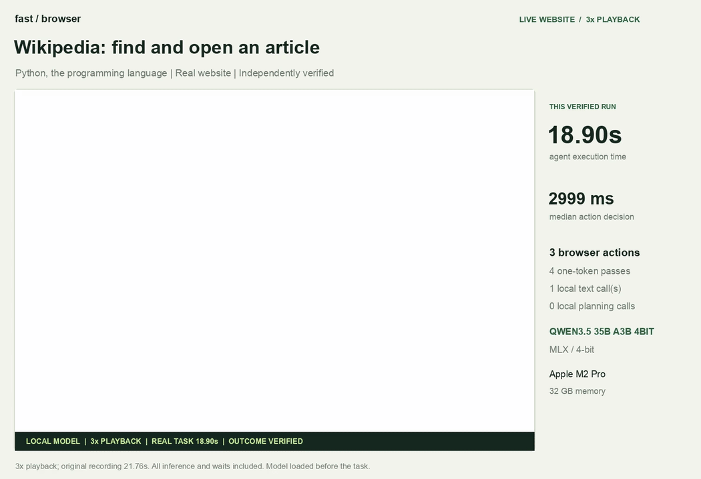
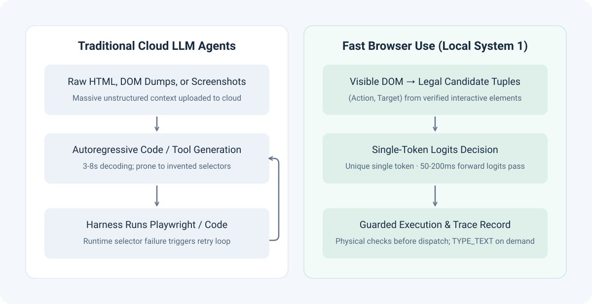
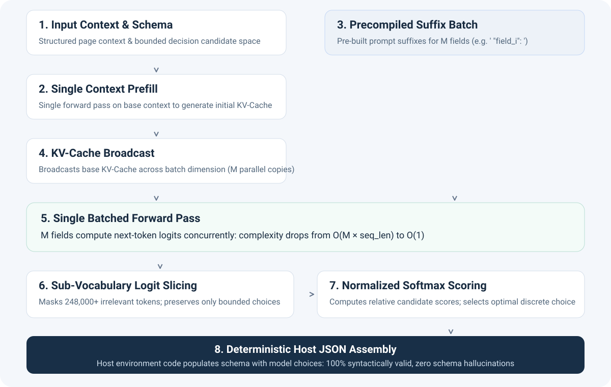
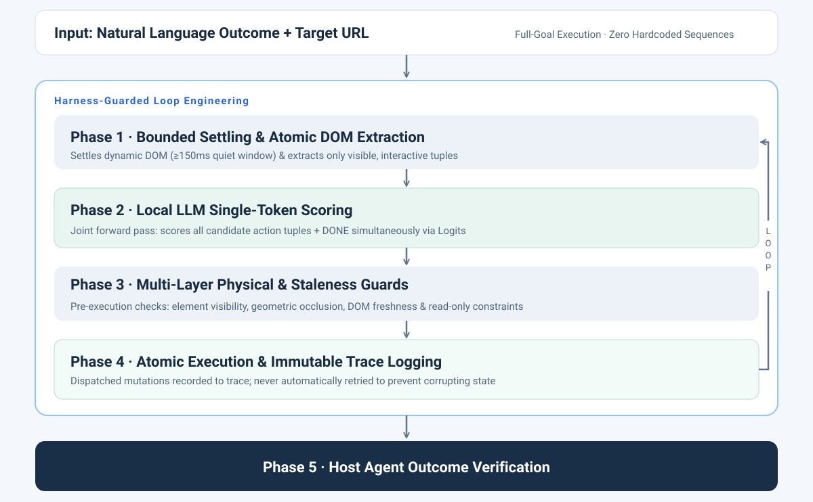

<div align="center">


# Fast Browser Use

**An ultra-fast, local-first "System 1" browser automation engine & Agent Skill for Claude Code, Codex, and Cursor.**  
*Powered by local Qwen3.5-9B / Qwen3.5-35B-A3B via MLX or PyTorch (CUDA / CPU). Zero cloud inference, second-level reflexes, zero selector hallucinations.*

[](LICENSE)
[](https://www.python.org/downloads/)
[](#linux--windows--gpu-servers-pytorch)
[](https://huggingface.co/Qwen)
[-orange.svg)](#-local-first-architecture)
[](skills/fast-browser-use/SKILL.md)

[English](README.md) · [简体中文](README.zh-CN.md) · [Quickstart](#-quickstart) · [Architecture & Deep Dive](#-architecture--deep-dive) · [Benchmarks](#-benchmarks--measurements) · [Agent Skill Setup](#-agent-skill-setup) · [Python API](#-python-api)

</div>

---

<div align="center">
<a href="docs/qwen35b-demo.mp4"></a>

**[Recording preview (3× playback acceleration)](docs/qwen35b-demo.mp4)** · **[Measurement Telemetry (JSON)](docs/qwen35b-demo-measurement.json)** · **[Performance Benchmarks](docs/performance.md)**
</div>

> **Open-Source Reverse Engineering of Jev · Pure Local Browser-Use Agent Skill**  
> Fast Browser Use reproduces Jev's System 1 discrete decision paradigm using open-source weights (Qwen3.5-9B / Qwen3.5-35B-A3B), grounded in real-world browser automation. By mapping visible interactive elements to vocabulary tokens for single-step logits scoring, it structurally eliminates selector hallucinations—packaged as an out-of-the-box agent skill for 100% local, offline execution.

---

## 💡 Background: Open-Source Reverse Engineering of Jev for Browser Use

In mid-September 2026, TypeSafe AI announced **Jev** (co-founded by ex-OpenAI researcher Diogo Almeida), sparking widespread discussion across the AI developer community:

> *"Why do we default to forcing massive 100B+ parameter LLMs to decode tokens one-by-one for bounded automated actions—enduring multi-second latencies and frequent hallucinations—when most software decisions are deterministic?"*

TypeSafe AI framed the paradigm around **System 1 (fast, calibrated discrete decisions)** vs. **System 2 (slow, deliberative planning)**. By training models via RLCD (Reinforcement Learning for Calibrated Decisions) to directly score bounded, typed decision spaces instead of generating free-form text, Jev demonstrated decision speeds 20–200× faster than traditional LLMs.

Currently, Jev is provided as a cloud API service without publicly available model weights or internal implementation details. While early community projects such as [`jev-ultrafast`](https://github.com/browser-use/jev-ultrafast) showcased the speed potential by connecting to this cloud endpoint, **Fast Browser Use** explores bringing this decision paradigm fully onto local devices using open-source weights—enabling a 100% offline, private, and zero-cloud-cost experience.

### Bringing the Paradigm 100% On-Device with Open Models

**Fast Browser Use** is an open-source reverse engineering and local reproduction of Jev's core decision mechanics, purpose-built for the demanding domain of **browser automation (`browser-use`)**.

By analyzing Jev's documented interface paradigms and evaluation logic, as well as drawing inspiration from open-source projects, we decoupled bounded categorical decisions from slow autoregressive text generation and ported the architecture to run 100% locally on Apple Silicon / GPU using **Qwen3.5-9B / Qwen3.5-35B-A3B**:

- **From Code Generation to Bounded Categorical Choice**: Traditional browser agents ask an LLM to generate raw Playwright scripts or CSS selectors, frequently causing "selector hallucinations" on dynamic pages. Fast Browser Use scans the rendered DOM tree, extracts only visible, interactable elements, and formats them into discrete candidate tuples `(CLICK, btn_7)`. The model selects exclusively from objectively existing elements—eliminating selector hallucinations by design.
- **Single-Token Logits Scoring ($O(1)$ Reflexes)**: Legal candidate actions are dynamically mapped to single discrete tokens in the vocabulary (`A`, `B`, `C`...). With a single forward pass, the engine evaluates normalized Softmax probabilities over candidate logits in **seconds (single forward pass)**, skipping the multi-second autoregressive text decoding loop entirely.
- **Decoupled Action & Generation**: Structural page actions (click, select, scroll) use discrete logits scoring; generative text completion is invoked only when typing content into fields (`TYPE_TEXT`).
- **100% Offline & Private**: Zero cloud API calls, zero telemetry, and zero subscription costs. The entire inference loop runs on your machine through MLX or PyTorch.

---

## 📊 Comparison: Cloud Agents vs. Fast Browser Use

| Dimension | Traditional Cloud Multimodal Agents | Fast Browser Use (Local System 1) |
| :--- | :--- | :--- |
| **Inference Location** | Cloud APIs (OpenAI, Anthropic, etc.) | **100% Local** (MLX or PyTorch CUDA / CPU) |
| **Step Latency** | 3,000 – 8,000 ms (Network + Decoding) | **Second-level** (Pure Logits Forward Pass) |
| **Decision Mechanism** | Autoregressive text/JSON generation | **Discrete candidate selection** (Single-Token) |
| **Selector Reliability** | Prone to invented CSS/XPath selectors | **Zero Hallucination** (Derived from visible DOM) |
| **Syntax Validity** | Subject to broken JSON, missing quotes | **100% Valid Syntax** (Deterministic host assembly) |
| **Data Privacy** | Full pages/screenshots transmitted to cloud | **100% Air-Gapped**, inference data stays on your machine |
| **Inference Cost** | Pay per token / per screenshot | **$0.00** (Free, on-device compute) |
| **Host Integration** | Standalone monolithic agent | **Standard Agent Skill** for Claude Code & Codex |

---

## 🧠 System 1 vs. System 2: Division of Labor

Fast Browser Use does not aim to replace macro-reasoning LLMs. Instead, it provides the missing **"System 1" (muscle memory & fast reflexes)** to complement **"System 2" (slow deliberate reasoning)**:



- **System 2 (Host Brain: Claude Code, Codex, Cursor, Antigravity)**:  
  Handles high-level user intent, multi-file code analysis, macro planning, and independent outcome verification.
- **System 1 (Local Engine: Fast Browser Use)**:  
  Handles high-frequency DOM sensing, micro-action selection, bounded waiting, and atomic page interactions.
- **Independent Audit**:  
  Upon completion, Fast Browser Use returns an immutable execution trace. The host agent independently verifies the resulting page state against ground truth before proceeding.

---

## 🔬 Architecture & Deep Dive

How does Fast Browser Use achieve extreme speed without closed-source weights? By transforming open-ended text generation into a **bounded categorical decision problem**:



### 1. Structurally Eliminating Selector Hallucinations
A lightweight in-page scanner inspects the rendered layout tree, extracting only **currently visible, interactable** elements. These are formatted into discrete candidate tuples:
```python
("CLICK", "btn_search")
("SELECT", "opt_timezone_sg")
("TYPE_TEXT", "input_query")
("DONE", "task_completed")
```
The model selects an action from this finite set. Because the model never writes selectors or Playwright code, selector hallucinations and syntax errors are mathematically impossible.

### 2. Single-Token Logits Scoring
Each legal candidate action is dynamically mapped to a unique single token in the tokenizer vocabulary (`A`, `B`, `C`...).  
Rather than generating text, the engine performs **one single forward pass**, extracts the next-token logits, and evaluates normalized Softmax probabilities:
$$P(c_i \mid \text{Context}) = \frac{\exp(z_i / T)}{\sum_{j=1}^K \exp(z_j / T)}$$
This reduces scoring from an $O(\text{tokens} \times \text{layers})$ autoregressive decoding loop to an $O(1)$ logits projection completed in seconds.

### 3. Action Selection & Text Generation Decoupling
Most browser interactions (clicking buttons, expanding dropdowns, scrolling) do not require creative writing.  
Fast Browser Use decouples structural navigation from text input:
- Structural choices use **single-token discrete scoring**.
- Only when the chosen action is `TYPE_TEXT` does the model perform targeted generative inference to compose the required field text.

### 4. KV-Cache Broadcasting & Batched Evaluation
By prefilling the common page context once and broadcasting the base KV-Cache across candidate dimensions, evaluating multiple fields or candidate options is parallelized into a single batch forward pass without cascading autoregressive error.

---

## 🛡️ Guarded Loop Engineering (The Harness)

A fast model without rigorous guardrails is brittle. Fast Browser Use wraps local inference inside a robust multi-layer harness:



1. **Bounded Settling Window**: Dynamic single-page apps (SPAs) often render asynchronously. A mandatory 150ms quiet window (≥500ms on new documents, ≥300ms post-input) ensures controls are fully mounted before scoring begins.
2. **Joint Action & `DONE` Scoring**: Candidate actions and completion (`DONE`) are scored within the same forward pass, slashing per-task inference passes from 14 to 4.
3. **Pre-Execution Physical Guards**:
   - **Visibility & Occlusion**: Ensures target elements are not hidden beneath overlays, modals, or banners.
   - **DOM Freshness**: Confirms that referenced nodes have not been detached or replaced by dynamic frameworks.
   - **Read-Only Protection**: Intercepts disabled or read-only controls before mutations occur.
4. **Write-Once Trace & No Mutation Retries**: Every action is immutably recorded to the execution trace before dispatch. Dispatched mutations are **never blindly retried** to prevent duplicate form submissions or destructive side effects.
5. **Independent Outcome Verification**: The model's `DONE` output is treated as a subjective hypothesis. Automated workflows must verify success through external assertions (`--expect-url`, `--expect-title`, `--expect-text`).

---

## ⚡ Benchmarks & Measurements

All measurements below were collected on consumer-grade hardware with **100% local inference** (zero cloud API requests):
- **Hardware**: Apple Silicon Mac (Apple M2 Pro, 32 GB unified memory, macOS)
- **Inference Stack**: MLX 0.32.2 / MLX-LM 0.31.3
- **Evaluated Models**: `Qwen3.5-9B MLX 4-bit` & `Qwen3.5-35B-A3B MLX 4-bit`

### 1. Wikipedia End-to-End Live Navigation

Task: *"Find and open the Wikipedia article about Python (programming language) starting from Main_Page, strictly verifying final URL and title."*

| Run Trial | Qwen3.5-9B Task Time | Qwen3.5-35B-A3B Task Time |
| :---: | :---: | :---: |
| Trial 1 | 30.079 s | 19.152 s |
| Trial 2 | 30.440 s | 18.902 s |
| Trial 3 | 30.091 s | 18.834 s |
| **Median** | **30.091 s** | **18.902 s** |

*Task completed in 4 discrete single-token scoring steps.*

### 2. Multi-Scenario Suite Performance

| Scenario & Task | Qwen3.5-9B Task Time | Qwen3.5-35B-A3B Task Time | Actions Executed | Independent Verification |
| :--- | :---: | :---: | :---: | :--- |
| **Wikipedia Navigation** (Find & open Python article) | **30.091 s** | **18.902 s** | Search focus, fill, select result, done | Strict match on final canonical URL & page title |
| **Workspace Settings Form** (Name, timezone dropdown, toggle weekly digest) | **12.002 s** | — | Fill, Select, Toggle, Save | Exact match on saved confirmation notification |
| **Local Reading Room Navigation** | **5.430 s** | — | Search, Link Click | Exact match on target article URL and title |
| **Python.org Navigation** (Navigate to About page) | **8.095 s** | — | Nav menu hover & click | Exact match on target `/about/` URL |
| **Example.com → IANA Info** | **7.309 s** | — | Anchor detection & jump | Exact match on destination domain |

---

## 🚀 Quickstart

### Prerequisites
- **Hardware**: Apple Silicon for MLX; NVIDIA GPU or CPU for PyTorch. See memory requirements below.
- **System**: Linux, Windows or macOS; Python 3.12+, [uv](https://docs.astral.sh/uv/getting-started/installation/)
- **Optional**: Node.js / npm (for `npx skills` installation)

---

### 📦 Agent Skill Setup (Claude Code / Codex / Cursor)

Fast Browser Use is packaged as a standard [Agent Skill](https://github.com/vercel-labs/skills).

#### Step 1: Register the Skill
```bash
# Register globally for Claude Code and Codex (-g = global across all projects)
npx skills add APUS-AI-Lab/fast-browser-use --skill fast-browser-use -a claude-code -a codex -g -y
```

#### Step 2: Install Local Runtime and Download Model Weights

Apple Silicon / MLX (for other platforms, use the PyTorch setup below):
```bash
# 1. Install the CLI in an isolated Python environment
uv tool install --python 3.12 "git+https://github.com/APUS-AI-Lab/fast-browser-use.git"

# 2. Install matching Playwright Chromium
fbu install-browser

# 3. Cache the pinned Qwen3.5-9B 4-bit weights (~5.95 GB)
fbu download
```
*(If you already have local Qwen3.5-9B 4-bit weights, specify `export FBU_MODEL=/path/to/weights` to skip downloading.)*

#### Step 3: Invoke from Your Host Agent
Launch a new agent session in any project:

**In Claude Code:**
```text
/fast-browser-use Open https://en.wikipedia.org/wiki/Main_Page, find the Python programming language article, and verify the final URL and title.
```

**In Codex:**
```text
$fast-browser-use Open https://en.wikipedia.org/wiki/Main_Page, find the Python programming language article, and verify the final URL and title.
```

---

### Linux / Windows / GPU servers (PyTorch)

The `torch` extra adds PyTorch, Transformers and Accelerate. `FBU_BACKEND=auto` selects MLX on
Apple Silicon and PyTorch elsewhere; `--backend torch` selects PyTorch explicitly.

```bash
# From a checkout on a Linux GPU server
uv sync --locked --extra torch --python 3.12
uv run fbu install-browser --with-deps

# Download 9B weights (default) or 35B-A3B weights
uv run fbu download --backend torch --model 9b
uv run fbu download --backend torch --model 35b

# Compare and record 9B vs 35B-A3B tasks
uv run fbu record --backend torch --device cuda --model 9b --scenario wikipedia --output artifacts/wikipedia_9b
uv run fbu record --backend torch --device cuda --model 35b --scenario wikipedia --output artifacts/wikipedia_35b
```

`--with-deps` installs Chromium's Linux system libraries and may require root/sudo. Neither a desktop,
`DISPLAY`, Xvfb, VNC nor the inspector is needed. All recordings explicitly use headless Chromium.
The original `browser.webm`, screenshots, trace and independent verification are saved on the server.

For a globally available CLI:

```bash
uv tool install --python 3.12 'fast-browser-use[torch] @ git+https://github.com/APUS-AI-Lab/fast-browser-use.git'
fbu install-browser --with-deps  # On Windows/macOS, omit --with-deps
fbu download --backend torch --model 9b
```

PyTorch supports selecting between the pinned original [Qwen/Qwen3.5-9B](https://huggingface.co/Qwen/Qwen3.5-9B)
and the MoE [Qwen/Qwen3.5-35B-A3B](https://huggingface.co/Qwen/Qwen3.5-35B-A3B) checkpoints
through the [Transformers text-only loader](https://huggingface.co/docs/transformers/model_doc/qwen3_5).
Select via `--model 9b` / `--model 35b` or `FBU_MODEL=35b` (defaults to `9b`).
MLX 4-bit files cannot be reused by PyTorch. When switching backends, remove an old `FBU_MODEL`
override or point it to matching local weights. Downloads use Hugging Face; the existing ModelScope
mirror is available for MLX only. After downloading, `HF_HUB_OFFLINE=1` prevents further Hub access;
browsing live websites still requires network access.

| Setting | Default / supported values |
| :--- | :--- |
| `FBU_BACKEND` / `--backend` | `auto`, `mlx`, `torch` |
| `FBU_DEVICE` / `--device` | `auto` → available CUDA, otherwise CPU; `cpu`, `cuda`, `cuda:N` |
| `FBU_DTYPE` / `--dtype` | `auto` → CUDA BF16 if supported, otherwise FP16; CPU FP32. Explicit `bfloat16`, `float16`, `float32` |
| `FBU_MODEL` / `--model` | Pinned repository, aliases (`9b`, `35b`), or a local compatible model directory |

CUDA runs on one selected GPU; `cuda:N` uses the index visible to PyTorch (including
`CUDA_VISIBLE_DEVICES`). Install a [PyTorch build matching your GPU driver](https://pytorch.org/get-started/locally/)
if the installed build does not expose CUDA. On Windows, the same CLI works from PowerShell;
use `$env:FBU_BACKEND='torch'` when setting environment variables.

Allow roughly 18 GB for 9B BF16/FP16 weights alone, plus cache and working memory; a 24 GB GPU is a
starting point. For 35B-A3B unquantized BF16/FP16 weights (roughly 70 GB alone; 35B total / 3B active parameters),
an 80 GB GPU (such as an A100/H100) is recommended.
CPU defaults to FP32 and is significantly slower. Current PyTorch execution does not load 4-bit weights or shard across multiple GPUs.
Optional optimized DeltaNet kernels are not required. Existing latency measurements are MLX results;
PyTorch currently recomputes the prompt for each score and does not reuse a prefix between decisions.

### 💻 Standalone CLI Usage & CI Assertions

Run tasks directly from the command line with external outcome verifiers:

```bash
# Generic web task with strict assertions
fbu run https://en.wikipedia.org/wiki/Main_Page \
  --goal 'Find and open the Wikipedia article about Python, the programming language.' \
  --expect-url 'https://en.wikipedia.org/wiki/Python_(programming_language)' \
  --expect-title 'Python (programming language) - Wikipedia' \
  --trace artifacts/wikipedia_trace.json
```

```bash
# Complex form filling with multiple expected text checks
fbu run 'https://target.example/settings' \
  --goal 'Save workspace preferences with timezone Asia/Singapore and weekly digest enabled.' \
  --expect-title 'Preferences saved' \
  --expect-text 'Timezone: Asia/Singapore.' \
  --expect-text 'Weekly digest: enabled.' \
  --trace artifacts/preferences.json
```

- `--expect-url` & `--expect-title`: Exact equality matching on final page state.
- `--expect-text`: Substring check on page text content (repeatable).
- Assertions read a fresh post-execution DOM state, are never passed into the model prompt, and fail the command if unmet.

<details>
<summary>Install from Local Checkout / Without Node.js</summary>

```bash
git clone https://github.com/APUS-AI-Lab/fast-browser-use.git
cd fast-browser-use
uv tool install --python 3.12 .
fbu install-browser
fbu download
```

Manual symlinks without Node.js:
```bash
mkdir -p "$HOME/.claude/skills" "$HOME/.agents/skills"
ln -s "$PWD/skills/fast-browser-use" "$HOME/.claude/skills/fast-browser-use"
ln -s "$PWD/skills/fast-browser-use" "$HOME/.agents/skills/fast-browser-use"
```

</details>

<details>
<summary>Hugging Face Model Download & Offline Mode</summary>

Download pre-quantized 4-bit weights directly from Hugging Face:
```bash
# Download to the default local cache
fbu download

# Or specify a custom output directory
uv run fbu download --output models/Qwen3.5-9B-4bit
FBU_MODEL=models/Qwen3.5-9B-4bit fbu run https://www.python.org/ \
  --goal 'Open the About Python page.' --expect-url 'https://www.python.org/about/'
```

After downloading, enable offline execution:
```bash
export HF_HUB_OFFLINE=1
```

</details>

---

## 🐍 Python API

Integrate Fast Browser Use directly into your Python automation workflows:

```python
from fast_browser_use import Agent
from fast_browser_use.model import get_model

# Warm up weights once
get_model()

# Execute task with fine-grained state streaming
with Agent("https://example.com", "Open the More information link.") as agent:
    for state in agent.run():
        print(f"[{state['elapsed_ms']}ms] Step status: {state['status']}")
        if "action" in state:
            print(f"  Action: {state['action']}")
```

---

## 🎥 Recording & Reproducing Demos

Recordings use Playwright Chromium video capture in headless mode, even if `FBU_HEADLESS=0`
is set for interactive debugging. No desktop recorder is used. Generate auditable videos with
labeled playback speeds (preview rendering requires `ffmpeg`/`ffprobe`; raw recording does not):

```bash
# Headless recording: saves 1x original video + telemetry, including inference/waits
uv run fbu record --scenario wikipedia
uv run fbu record --scenario wikipedia --model 35b

# Render labeled preview (target <= 10s with preserved original)
uv run python scripts/render_demo.py artifacts/recordings/<timestamp> --max-seconds 10
```

---

## 🛠️ Verification & Development

Run the full local test and guard suite:

```bash
uv run ruff check .
uv run pytest
# Also run tiny random-model PyTorch tests without downloading pretrained weights:
uv run --extra torch pytest tests/test_torch_backend.py
node --check fast_browser_use/static/app.js
node --check fast_browser_use/snapshot.js
uv run python scripts/check_guards.py
uv build
```

---

## 📄 License & Attribution

This project is licensed under the [MIT License](LICENSE).  
Inspired by [Jev Ultrafast](https://github.com/browser-use/jev-ultrafast). Upstream MIT attribution and notices are preserved in [NOTICE](NOTICE). This project also draws inspiration and ideas from [openjev](https://github.com/TheoLeeCJ/openjev) and [Qwen-2.5-1B-RLCD](https://huggingface.co/harshatheg/Qwen-2.5-1B-RLCD).

---

<div align="center">
<b>Fast Browser Use</b> · Built for the next generation of autonomous local-first agents.
</div>
